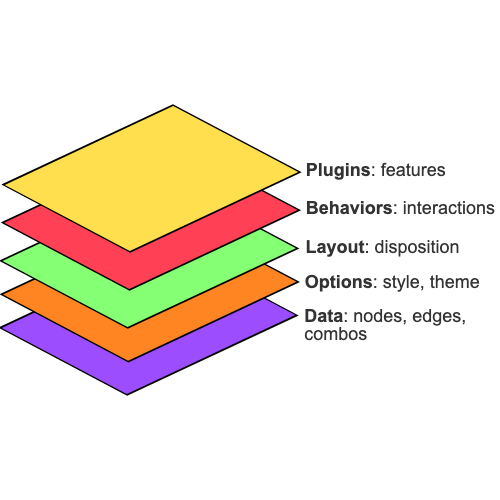

<!-- README.md is generated from README.Rmd. Please edit that file -->

```{r, include = FALSE}
knitr::opts_chunk$set(
  collapse = TRUE,
  comment = "#>",
  fig.path = "man/figures/README-",
  out.width = "100%"
)
```

# g6R

<!-- badges: start -->
  [](https://github.com/cynkra/g6R/actions/workflows/R-CMD-check.yaml)
[](https://lifecycle.r-lib.org/articles/stages.html#experimental)
[](https://CRAN.R-project.org/package=g6R)
<!-- badges: end -->

<p style="text-align: center;">
{width="50%" alt="g6R hex logo"}
</p>

`{g6R}` provides R bindings to the G6 graph [library](https://g6.antv.antgroup.com/en). It allows to create interactive network in R, with stunning set of features, including:

- Support for various __layouts__, such as force-directed, radial, circular, and hierarchical layouts.
- Interactive __behaviors__ like zooming, dragging, and selecting elements.
- __Plugins__ for additional functionality, such as minimaps and tooltips, context menus, and node grouping features like bubble sets, hulls and legends.
- Various __data sources__ including data frames, lists and remote JSON urls.
- Support for __combos__ allowing for __nested__ nodes.
- High __performance__ rendering (>20000 nodes).

<p style="text-align: center;">
{width="50%" alt="g6R layers example"}
</p>

## Installation

You can install the development version of `{g6R}` from [GitHub](https://github.com/) with:

``` r
# install.packages("pak")
pak::pak("cynkra/g6R")
```

## Example

To create a `{g6R}` graph:

```r
library(g6R)
nodes <- data.frame(id = 1:10)

# Generate random edges
edges <- data.frame(
  source = c(2, 6, 7),
  target = c(1, 3, 9)
)

g6(nodes, edges) |>
  g6_options(
    node = list(
      style = list(
        labelBackground = TRUE,
        labelBackgroundFill = '#FFB6C1',
        labelBackgroundRadius = 4,
        labelFontFamily = 'Arial',
        labelPadding = c(0, 4),
        labelText = JS(
          "(d) => {
              return d.id
            }"
        )
      )
    )
  ) |>
  g6_layout(d3_force_layout()) |>
  g6_behaviors(
    "zoom-canvas",
    drag_element_force(fixed = TRUE),
    click_select(
      multiple = TRUE,
      onClick = JS(
        "(e) => {
            console.log(e);
          }"
      )
    ),
    brush_select(),
    create_edge()
  ) |>
  g6_plugins(
    "minimap",
    "tooltip",
    context_menu()
  )
```
