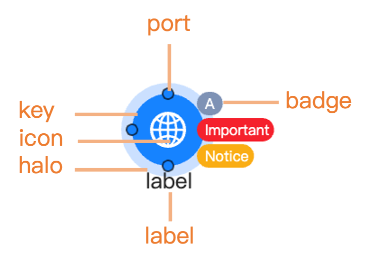

# Nodes

``` r
library(shiny)
library(g6R)
```

## Introduction

Nodes belong to the graph data. In [g6R](https://github.com/cynkra/g6R),
nodes can be created from a **dataframe** or a **list** such as:

``` r
nodes <- data.frame(id = 1:2)

# or
nodes <- list(
  list(id = 1),
  list(id = 2)
)
```

While **dataframes** might be more convenient for simple cases,
**lists** provides more flexibility for advanced customization since
some node properties have to be nested lists, for instance **style**
properties:

``` r
nodes <- list(
  list(
    id = 1,
    style = list(fill = "#FF0000", fillOpacity = 0.5)
  ),
)
```

In [g6R](https://github.com/cynkra/g6R), the preferred way to create
nodes is by using the helper functions
[`g6_node()`](https://cynkra.github.io/g6R/reference/g6_element.md) and
[`g6_nodes()`](https://cynkra.github.io/g6R/reference/g6_elements.md).
These functions provide a consistent and user-friendly interface for
node creation, supporting both simple and advanced customization.
[`g6_node()`](https://cynkra.github.io/g6R/reference/g6_element.md)
allows you to define a single node with specific properties, while
[`g6_nodes()`](https://cynkra.github.io/g6R/reference/g6_elements.md)
and
[`as_g6_nodes()`](https://cynkra.github.io/g6R/reference/as_g6_elements.md)
can generate multiple nodes from various input format (data.frame,
list):

``` r
as.list(methods("as_g6_node"))
#> [[1]]
#> [1] "as_g6_node.g6_node"
#> 
#> [[2]]
#> [1] "as_g6_node.list"
as.list(methods("as_g6_nodes"))
#> [[1]]
#> [1] "as_g6_nodes.data.frame"
#> 
#> [[2]]
#> [1] "as_g6_nodes.g6_nodes"
#> 
#> [[3]]
#> [1] "as_g6_nodes.list"
```

Using these helpers ensures compatibility with all
[g6R](https://github.com/cynkra/g6R) features and is the recommended
method for node creation.

For example:

``` r
# Create a single node
node <- g6_node(id = "A", type = "circle", style = list(fill = "#FFB6C1"))

# Create multiple nodes from a data frame
df <- data.frame(id = c("A", "B"), type = c("circle", "rect"))
nodes <- as_g6_nodes(df)

# With g6_nodes()
nodes <- g6_nodes(
  g6_node(id = "A", type = "circle"),
  g6_node(id = "B", type = "rect")
)

# with a list
lst <- list(
  list(id = "A", type = "circle"),
  list(id = "B", type = "rect")
)
nodes <- as_g6_nodes(lst)
nodes
#> [[1]]
#> $id
#> [1] "A"
#> 
#> $type
#> [1] "circle"
#> 
#> attr(,"class")
#> [1] "g6_node"    "g6_element"
#> 
#> [[2]]
#> $id
#> [1] "B"
#> 
#> $type
#> [1] "rect"
#> 
#> attr(,"class")
#> [1] "g6_node"    "g6_element"
#> 
#> attr(,"class")
#> [1] "g6_nodes"
```

## Data properties

[g6R](https://github.com/cynkra/g6R) nodes are allowed to have the
following properties:

- `id`: a unique identifier for the node, required.
- `type`: the type of the node.
- `data`: custom data for the node that can be retrieved.
- `style`: style properties. A comprehensive list is available
  [here](https://g6.antv.antgroup.com/en/manual/element/node/build-in/base-node#style).
- `states`: initial
  [states](https://g6.antv.antgroup.com/en/manual/element/node/build-in/base-node#state).
  An unnamed list of valid states.
- `combo`: id of the
  [combo](https://g6.antv.antgroup.com/en/manual/element/combo/overview)
  the node belongs to. Combo are describes in another vignette (TBD
  link).
- `children`: nodes ids for tree.

### Node type

Builtin types are `circle`, `rect`, `ellipse`, `diamond`, `triangle`,
`hexagon`, `star`, `donut`:

``` r
types <- c(
  "circle",
  "rect",
  "ellipse",
  "diamond",
  "triangle",
  "hexagon",
  "star"
)
nodes <- lapply(seq_along(types), \(i) {
  list(id = types[[i]], type = types[[i]])
})
g6(nodes) |>
  g6_layout(d3_force_layout()) |>
  g6_options(
    animation = FALSE,
    node = list(
      style = list(
        labelText = JS(
          "(d) => {
            return d.id
          }"
        )
      )
    )
  )
```

### Special types

#### Images

You can create nodes with images by setting the `type` to `image` and
providing a `src` property in the `style`. The image will be displayed
as the node content:

``` r
nodes <- list(
  list(
    id = 1,
    type = "image",
    style = list(
      src = "https://gw.alipayobjects.com/mdn/rms_6ae20b/afts/img/A*N4ZMS7gHsUIAAAAAAAAAAABkARQnAQ"
    )
  )
)
g6(nodes, height = "100px") |>
  g6_layout(d3_force_layout()) |>
  g6_options(
    animation = FALSE,
    node = list(
      style = list(
        labelText = JS(
          "(d) => {
            return d.id
          }"
        )
      )
    )
  )
```

#### HTML nodes

There exists a last type which allows to create nodes with custom html.
Importantly, you can’t have html nodes with other type of nodes. The
type applies at the global node option level as shown in the following.
The node structure is created with the `innerHTML` property which has to
be a JavaScript callback taking node data as parameter:

``` r
nodes <- data.frame(id = 1:3)
g6(nodes, height = "200px") |>
  g6_layout(d3_force_layout()) |>
  g6_options(
    animation = FALSE,
    node = list(
      type = "html",
      style = list(
        innerHTML = JS(
          "(d) => {
            return `
              <div class=\"card\" style=\"width: 13rem;\">
                <div class=\"card-body\">
                  This is node: ${d.id}
                </div>
              </div>`;
            }"
        )
      )
    )
  )
```

#### Donut

You can create donut nodes by setting the `type` to `donut`. The `style`
property should contain a JavaScript function that returns an array of
objects, each with a `value`, `color` and other possible properties
described
[here](https://g6.antv.antgroup.com/en/manual/element/node/build-in/donut#donutround),
if you want to customize the segments of the donut. You may give an
`data.index` property to the node to distinguish between different
donuts and customize the output, as shown in the example below.

``` r
nodes <- list(
  list(
    id = 1,
    data = list(index = 0)
  ),
  list(
    id = 2,
    data = list(index = 1)
  )
)
g6(nodes, height = "200px") |>
  g6_layout(d3_force_layout()) |>
  g6_options(
    animation = FALSE,
    node = list(
      type = "donut",
      style = list(
        donuts = JS(
          "(item) => {
            const { index } = item.data;
            if (index === 0) {
              return [
                  { value: 50, color: 'red' },
                  { value: 150, color: 'green' },
                  { value: 100, color: 'blue' },
                ];
            }
            if (index === 1) {
              return [
                  { value: 100, color: 'yellow' },
                  { value: 50, color: 'purple' },
                  { value: 150, color: 'orange' },
                ];
            }
          }"
        )
      )
    )
  )
```

### Styling nodes

The `g6` JavaScript library exposes a wide range of style properties for
nodes, which can be set in the `style` property of the node data. We
list below the most outstanding properties, but you can find a
comprehensive list in the
[documentation](https://g6.antv.antgroup.com/en/manual/element/node/build-in/base-node#style).



#### Main graphic properties

These properties are used to define the main graphic
[style](https://g6.antv.antgroup.com/en/manual/element/node/build-in/base-node#main-graphic-style)
of the node, such as color, width, and line type. They can be applied at
the global node option level or at the individual node level. Here is an
example of how to set the color for all nodes of the same graph:

``` r
nodes <- data.frame(id = 1:2)
g6(nodes, height = "200px") |>
  g6_layout(d3_force_layout()) |>
  g6_options(
    node = list(
      style = list(
        fill = "#FFB6C1", # Node fill color
        fillOpacity = 0.5, # Node fill opacity
        stroke = "#000", # Node border color
        lineWidth = 2, # Node border width
        radius = 10 # Node corner radius
      )
    )
  )
```

#### Label styling

Some common properties include label
[styling](https://g6.antv.antgroup.com/en/manual/element/node/build-in/base-node#label-style):

``` r
nodes <- list(
  list(
    id = 1,
    style = list(
      label = TRUE, # Whether to display the node label
      labelText = "Node Name", # Label text content
      labelFill = "#000", # Label text color
      labelFontSize = 15, # Label font size
      labelFontWeight = "normal", # Label font weight
      labelPlacement = "bottom" # Label position relative to the main graphic of the node
    )
  )
)

g6(nodes, height = "200px") |>
  g6_layout(d3_force_layout())
```

#### Badges

You can add
[badges](https://g6.antv.antgroup.com/en/manual/element/node/build-in/base-node#badge-style)
to nodes using the `badge` property in the `style` list. Badges are
small indicators that can display additional information, such as counts
or statuses:

``` r
nodes <- list(
  list(
    id = 1,
    style = list(
      badge = TRUE, # Whether to display the badge
      badges = list(
        list(text = "A", placement = "right-top"),
        list(text = "Important", placement = "right"),
        list(text = "Notice", placement = "right-bottom")
      ),
      badgePalette = c("#7E92B5", "#F4664A", "#FFBE3A"), # Badge background color palette
      badgeFontSize = 7 # Badge font size
    )
  )
)

g6(nodes, height = "200px") |>
  g6_layout(d3_force_layout())
```

#### Ports

[Ports](https://g6.antv.antgroup.com/en/manual/element/node/build-in/base-node#port-style)
are special points on nodes that can be used for connecting edges. They
can be defined in the `style` property of the node data. You can specify
the position and other properties of each port:

``` r
nodes <- list(
  list(
    id = 1,
    style = list(
      port = TRUE,
      ports = list(
        list(
          key = "top",
          placement = c(0.5, 1),
          fill = "#7E92B5"
        ),
        list(
          key = "right",
          placement = c(1, 0.5),
          fill = "#F4664A"
        ),
        list(
          key = "bottom",
          placement = c(0.5, 0),
          fill = "#FFBE3A"
        ),
        list(
          key = "left",
          placement = c(0, 0.5),
          fill = "#D580FF"
        )
      ),
      portR = 3,
      portLineWidth = 1,
      portStroke = "#fff"
    )
  )
)

g6(nodes, height = "200px") |>
  g6_layout(d3_force_layout())
```

### States

Nodes can have different
[states](https://g6.antv.antgroup.com/en/manual/element/node/build-in/base-node#state)
that can be used to indicate different conditions or interactions.
States can be set in the `states` property of the node data:

``` r
states <- c(
  "default",
  "selected",
  "highlight",
  "active",
  "inactive",
  "disabled"
)
nodes <- lapply(seq_along(states), \(i) {
  list(id = i, states = list(states[[i]]), data = list(state = states[[i]]))
})
g6(nodes) |>
  g6_layout(d3_force_layout()) |>
  g6_options(
    animation = FALSE,
    node = list(
      style = list(
        labelText = JS(
          "(d) => {
            return d.data.state
          }"
        )
      )
    )
  )
```

### Color palette

TBD

## Update nodes data

These functions can only be used in a Shiny app context. They allow you
to get or update the nodes data in the graph after it has been created.
The functions are:

- [`g6_add_nodes()`](https://cynkra.github.io/g6R/reference/g6-add.md):
  adds new nodes to the graph.
- [`g6_update_nodes()`](https://cynkra.github.io/g6R/reference/g6-update.md):
  updates existing nodes in the graph.
- [`g6_remove_nodes()`](https://cynkra.github.io/g6R/reference/g6-remove.md):
  removes nodes from the graph.
- [`g6_set_nodes()`](https://cynkra.github.io/g6R/reference/g6-set.md):
  set node state.
- [`g6_get_nodes()`](https://cynkra.github.io/g6R/reference/g6-get.md):
  get nodes data from the graph.

We provide more details and examples in the [Shiny integration
vignette](https://cynkra.github.io/g6R/articles/shiny.html).
